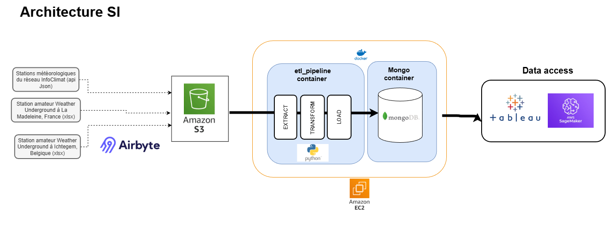

# OCR - Projet 8  
**Concevez et analysez une base de données NoSQL**  
*Janvier 2026*  

## Contexte du projet  
**Entreprise :** GreenAndCoop, fournisseur coopératif d’électricité renouvelable dans les Hauts-de-France.  
**Projet :** Forecast 2.0, initiative Data Science visant à améliorer la prévision de la demande d’électricité.  
**Problématique :** Les prévisions sont moins fiables dans certaines zones en raison du manque de relevés précis des stations météorologiques officielles.  

**Objectif :** Fournir des données météorologiques de qualité aux Data Scientists pour leurs modèles de prévision, via une base centralisée compatible AWS (MongoDB) et accessible depuis SageMaker.  

## Sources de données  
- **Infoclimat :** Relevés météorologiques de plusieurs stations, déjà bien formatées, en format JSON.  
- **Stations amateurs France (La Madeleine) et Belgique (Ichtegem) :** Relevés météorologiques de stations indépendantes, en format Excel.  

## Architecture et pipeline  



1. **Ingestion des données** via **Airbyte** dans un bucket **S3**.  
2. **Pipeline ETL** : extraction, nettoyage et transformation des données.  
3. **Stockage** dans un **MongoDB Container**, accessible pour analyses et visualisations (Tableau).  
4. **Déploiement** sur **AWS EC2 Ubuntu** via Docker. Le pipeline est orchestré sur AWS et les étapes ETL sont automatisées.  

### ETL – objectifs et transformations (cf presentations/logigramme_ETL.png)
- Conserver uniquement les relevés pertinents pour l’analyse :  
  - Relevés horaires valides  
  - Suppression des doublons  
  - Conservation des stations correctes ou avec données complètes  
- Normalisation des unités et nettoyage des valeurs incohérentes  

### Tests unitaires
- Vérification du formatage des valeurs  
- Détection et suppression des doublons  
- Normalisation des données  
- Nettoyage des incohérences  

### Tests d’intégration
- Connexion au serveur MongoDB  
- Exécution de requêtes de base  
- Tests de performance et temps d’exécution  

## Contenu du projet  

```
project/
├── extract_transform/
│   ├── __init__.py                     # Fichier d'initialisation du module
│   ├── main_script_extract_transform.py # Script principal pour extraire et transformer les données
│   └── test_extract_transform.py       # Tests unitaires pour l'extraction et la transformation
├── load/
│   ├── load_mongo.py                   # Script pour charger les données dans MongoDB
│   └── tests_integration.py            # Tests d'intégration du chargement
├── orchestration/
│   ├── __pycache__/                    # Fichiers Python compilés
│   └── run_pipeline.py                 # Script pour exécuter l'ensemble du pipeline ETL
├── logs/
│   └── pipeline.log                     # Fichier de log généré par le pipeline
├── presentations/                      # Contient les documents et visualisations de présentation
├── venv/                               # Environnement virtuel Python
├── .env                                # Variables d'environnement (MongoDB, AWS, etc.)
├── .gitignore                           # Fichiers et dossiers ignorés par Git
├── docker-compose.yml                  # Configuration Docker pour le projet
├── Dockerfile                          # Dockerfile pour containeriser l'application
├── init-replica.js                      # Script pour initialiser un replica set MongoDB
├── README.md                            # Documentation du projet
└── requirements.txt                     # Liste des dépendances Python
```


## Justification des choix technologiques
- **MongoDB :** flexibilité pour gérer des données semi-structurées et volumineuses  
- **Airbyte :** ingestion simple et fiable depuis plusieurs sources  
- **AWS EC2 :** déploiement et orchestration du pipeline ETL déjà conteneurisés - contrôle de l’environnement et du déploiement Docker, idéal pour tester et orchestrer le pipeline ETL


## Outils utilisés
- Python  
- MongoDB  
- AWS (EC2, S3)  
- Airbyte  